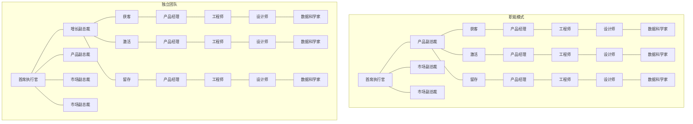
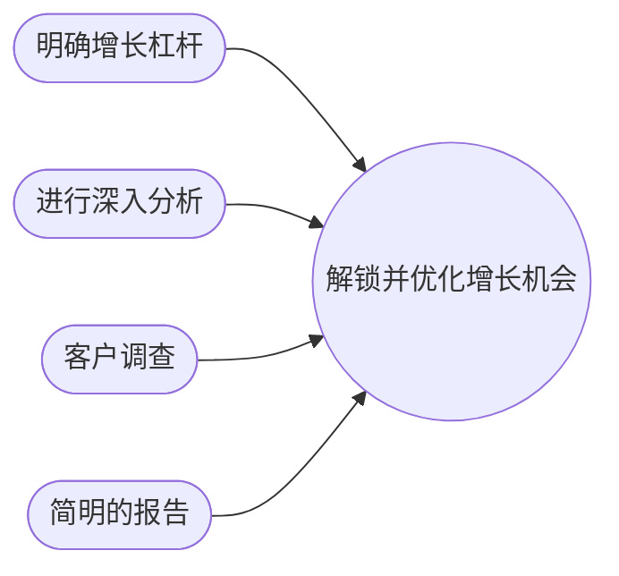
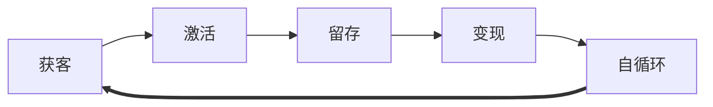
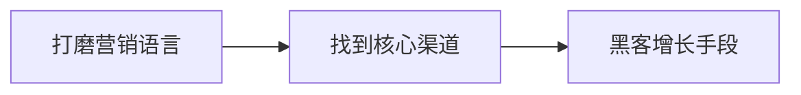
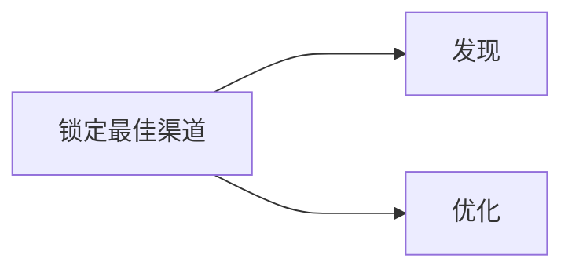
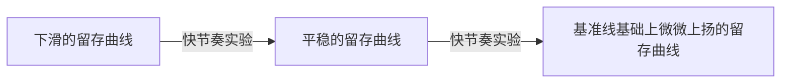
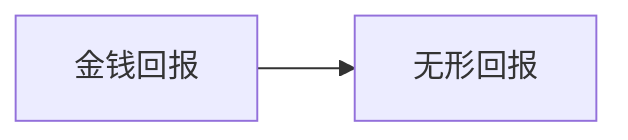

# 增长黑客读书笔记
* * *
- [增长黑客读书笔记](#增长黑客读书笔记)
  - [一、组织管理](#一组织管理)
    - [1. 团队搭建](#1-团队搭建)
      - [1.1.增长团队结构](#11增长团队结构)
        - [1.1.1. 人员构成](#111-人员构成)
        - [1.1.2. 团队规模与工作范畴](#112-团队规模与工作范畴)
        - [1.1.3. 工作流程:thinking:](#113-工作流程thinking)
        - [1.1.4. 人员分工](#114-人员分工)
      - [1.2. 汇报结构](#12-汇报结构)
        - [1.2.1. 必要的高层支持](#121-必要的高层支持)
        - [1.2.2. 两种汇报结构](#122-两种汇报结构)
        - [1.2.3. 化解阻力](#123-化解阻力)
      - [1.3. 如何开始](#13-如何开始)
    - [2. 打造好的产品](#2-打造好的产品)
      - [2.1. 确定产品是否满足基本要求（两步）:question:](#21-确定产品是否满足基本要求两步question)
      - [2.2. 找出啊哈时刻没有实现的原因](#22-找出啊哈时刻没有实现的原因)
      - [2.3. 实现啊哈时刻](#23-实现啊哈时刻)
    - [3. 确定增长杠杆:](#3-确定增长杠杆)
      - [3.1. 明确哪些指标对产品增长最为重要](#31-明确哪些指标对产品增长最为重要)
      - [3.2. 整合数据资源](#32-整合数据资源)
      - [3.3. 客户调查](#33-客户调查)
      - [3.4. 简明的报告](#34-简明的报告)
    - [4. 快节奏实验](#4-快节奏实验)
      - [4.1. 准备工作](#41-准备工作)
      - [4.2. 增长黑客循环:repeat:](#42-增长黑客循环repeat)
        - [4.2.1. 第一阶段：分析](#421-第一阶段分析)
        - [4.2.2. 第二阶段：提出想法](#422-第二阶段提出想法)
        - [4.2.3. 第三阶段：排定优先级](#423-第三阶段排定优先级)
        - [4.2.4. 第四阶段：测试](#424-第四阶段测试)
        - [4.2.5. 回到第一阶段：实验总结](#425-回到第一阶段实验总结)
      - [4.3. 增长会议](#43-增长会议)
        - [4.3.1. 会议的目的](#431-会议的目的)
        - [4.3.2. 会议前的安排](#432-会议前的安排)
        - [4.3.3. 会议日程](#433-会议日程)
      - [4.4. 增长黑客过程的优点](#44-增长黑客过程的优点)
  - [二、AARRR模型](#二aarrr模型)
    - [1\. 获客](#1-获客)
      - [1.1. 框架](#11-框架)
      - [1.2. 打磨营销语言](#12-打磨营销语言)
      - [1.3. 核心渠道](#13-核心渠道)
        - [1.3.1. 发现](#131-发现)
        - [1.3.2. 优化](#132-优化)
      - [1.4. 设计病毒循环](#14-设计病毒循环)
    - [2. 激活](#2-激活)
      - [2.1. 找出最大影响力激活实验的三个关键步骤](#21-找出最大影响力激活实验的三个关键步骤)
      - [2.2. 提高激活的最佳做法](#22-提高激活的最佳做法)
        - [2.2.1. 优化新用户体验](#221-优化新用户体验)
        - [2.2.2. 积极的摩擦](#222-积极的摩擦)
      - [2.3. 使用触发物](#23-使用触发物)
    - [3. 留存](#3-留存)
      - [3.1. 留存的复合价值](#31-留存的复合价值)
      - [3.2. 留存的三个阶段](#32-留存的三个阶段)
      - [3.3. 需要跟踪哪些指标:star2:](#33-需要跟踪哪些指标star2)
      - [3.4. 如何通过数据分析寻找增长手段](#34-如何通过数据分析寻找增长手段)
    - [4. 变现](#4-变现)
      - [**4.1. 绘制变现漏斗**](#41-绘制变现漏斗)
      - [4.2. 关注每个群组地贡献](#42-关注每个群组地贡献)
      - [4.3. 认识你的用户（构建用户画像）](#43-认识你的用户构建用户画像)
      - [4.4. 调查用户的需求](#44-调查用户的需求)
      - [4.5. 利用数据和算法为用户定制产品和功能](#45-利用数据和算法为用户定制产品和功能)
      - [4.6. 优化定价](#46-优化定价)
      - [4.7. 几个需要注意的问题](#47-几个需要注意的问题)
    - [5. 自循环](#5-自循环)
      - [5.1. 避免增长停滞](#51-避免增长停滞)
      - [5.2. 一些可能阻碍增长团队的常见问题](#52-一些可能阻碍增长团队的常见问题)

## 一、组织管理

### 1. 团队搭建

打破筒仓：搭建跨职能的增长团队能够打破这种壁垒

#### 1.1.增长团队结构

##### 1.1.1. 人员构成

**增长负责人**

职责（管理者兼产品负责人兼数据科学家）：

1.  确定实验流程和节奏
2.  选定核心关注点，团队工作的目标和时间表
3.  确保团队采用适合既定的增长目标的指标来衡量并改进结果

基本技能：

1.  熟练进行数据分析
2.  精通或熟悉产品管理（即开发与发布产品的过程）
3.  了解如何设计并开展实验
4.  熟知促进用户增长的方法以及团队所负责产品或服务的用法
5.  相关的行业或产品知识
6.  能激励团队加快实验节奏

**产品经理**

职责：

1.  产品经理负责监督产品及其功能的实现过程
2.  帮助公司更好地理解并满足客户的需求

产品经理 --> 产品总监 --\> 首席产品官

**软件工程师**

职责：

1.  为产品功能写代码
2.  为移动界面写代码
3.  为网页写代码

**营销专员**

**数据分析师**

1.  懂得如何确保实验的设计严密且在统计上有效
2.  懂得如何获取不同来源的客户和业务数据并将这些数据结合在一起分析用户行为
3.  能迅速整理实验结果并从中提取结论

**产品设计师**

职责：

1.  软件开发领域：专注于用户体验的设计师负责开发与用户交互的界面和序列
2.  制造业：负责产品画图和规格
3.  其他行业：负责广告和推广文案的图像设计

##### 1.1.2. 团队规模与工作范畴

团队规模：刚成立的增长团队-->从不同部门抽调一两个员工，团队的规模可以日后逐渐扩增，也可能另外设立新的团队。

 大公司 --\> 独立的完整团队

工作范畴：

1.  第一种比较宽泛，负责公司各个领域的增长业务
2.  第二种比较具体，负责某产品某个部分的改进

##### 1.1.3. 工作流程:thinking:

(1)数据分析与洞察收集 --> (2)想法产生 --> (3)排定实验优先级 --> (4)实验执行

团队应该定期召开增长会议以保证工作进度（一般一周一次）

##### 1.1.4. 人员分工

1.  每个团队成员仍然应负责各自擅长的工作，有时也需要独立工作。
2.  团队成员在其他时候也需要密切合作。

#### 1.2. 汇报结构

##### 1.2.1. 必要的高层支持

团队应该由一位高管负责，以确保团队有权越过既定的部门职责界限开展工作

创业公司中：

- 创始人或CEO直接领导增长团队
- 团队直接向创始人或CEO汇报

大公司：

- 同时又几个增长团队，团队应该向副总裁或者首席官中的一位汇报，这位首席官能保证整个首席官团队都支持增长团队的工作

##### 1.2.2. 两种汇报结构

1.  职能模式（或产品主导模式）：这一模式下，增长团队向主管其工作范围内的某个产品或几个产品的高管汇报。职责范围可能仅限于改进产品某一个方面的性能。（这个模式能避免企业结构的大规模重组，减少摩擦）
2.  创建一个独立的团队：增长团队的负责人向增长副总裁汇报，而增长副总裁一般直接向CEO或者其他高管汇报。职能范围有权就公司所有类型的产品开展实验，甚至可以在公司现有产品线之外寻找战略层面的增长机遇。（公司发展初期成立独立增长团队阻力是最小的）

##### 1.2.3. 化解阻力

1.  公司要为整个团队实现共同增长目标提供充分的激励和奖励措施
2.  确保在决定实验的优先顺序以及评价实验结果时严格用数据说话，而不是主观臆断

#### 1.3. 如何开始

1.  试着先成立一个团队使其只专注某一个产品，甚至是产品的某一个方面，也可以只关注某一个指标
2.  随着成功的积累，增长团队的责任范围可以逐渐扩大，或者成立更多的增长团队
3.  开始前先获得上层的支持
4.  增长团队不应该过早启动（先要产出不可或缺的产品）

### 2. 打造好的产品

**基本原则：**在确定你的产品**是否不可或缺**、**为何不可或缺**以及**对谁来说不可或缺**之前不要进入快节奏实验阶段（产品的核心价值）

> “是爱创造了增长，而不是增长创造了爱” --\> 啊哈时刻

**啊哈时刻：**产品使用户眼前一亮的时刻，是用户真正发现产品核心价值——产品为何存在、他们为何需要它以及他们能从中得到什么——的时刻

#### 2.1. 确定产品是否满足基本要求（两步）:question:

**第一步：设计一个简单的调查**

*如果这个产品明天就无法使用了你会有多失望？A. 非常失望 B.有一点失望 C. 不失望 D. 不适用——已经弃用产品*

1.  如果40%或更多的回复是“非常失望”，那就意味着产品已经获得了足够的不可或缺性，也就是说团队已经具备了全力驱动增长的条件
2.  如果25%~40%的回复是“非常失望”，团队需要对产品做一些微调，或者调整描述产品及用法所使用的语言。
3.  如果“非常失望”的回复不到25%，可能现有用户并不适合你的产品，或者产品本身需要更具实质性的开发才能展开攻势。

如果是第三种情况调查还需要包括以下几个问题：

1.  *如果本产品无法使用了，你会用什么替代产品？*（帮助锁定主要竞争对手）
2.  *本产品给你带来的主要价值是什么？*（帮助你发现为实现这个价值你应该增加的功能）
3.  *你向别人推荐过本产品嘛？*（衡量产品是否具备口碑营销的潜力以及探究如何最大限度地发挥这一潜力）
4.  *你认为那种人最能够从本产品中受益？*（帮助团队锁定更加清晰地客户群，从而更有效地向他们推荐产品）
5.  *我们应该如何改进本产品以更好地满足你的需求？*（帮助团队发现阻碍产品获得广泛使用的主要问题，也能凸显公司自身没有想到的产品改进机会）
6.  *我们是否可以通过邮件跟进，邀请你对回答做出进一步说明？*

调查的目标群体：最好是活跃用户而不是“休眠用户”

调查的时间：只用于早期确定你的产品是否具备核心价值，而不是用于增长阶段

**第二步：查看用户留存**

在一定时间内继续使用产品或者付费使用产品的用户比例

你需要获得比竞争对手更高的留存率，并且维持这一水平。

密切跟踪流失用户人群，通常是关注每周或者每月的数据

#### 2.2. 找出啊哈时刻没有实现的原因

1.  开展更多的客户调查，包括采访和实地调研，真正与客户和潜在客户交谈
2.  针对产品改动和信息传达进行高效实验
3.  深入分析用户数据

对于第一点：带上产品或者原型去实地采访（走进用户的现实世界）、对网上现有用户群体进行调研

对于第二点：最小可行测试MVT，既有较复杂的产品改进实验，也有很容易执行的信息传达和营销实验

1.  改进信息传达的方式：A/B测试（对客户体验漏斗的整个过程开展试验AARRR），多变量测试，多臂老虎机……
2.  针对产品的实验：应该优先测试那些经之前经验证实能够优化结果并改进用户体验的改动，假设应该是在充分的用户调研和数据分析之后得出

对于第三点：收集合适的数据，并将不同来源的数据整合起来，形成一个完整的知识图谱（数据仓库），你应该掌握的不仅仅是表面数据，而是用户体验各个层面的数据。

1.  跟踪活跃用户的行为：跟踪用户的关键行为，这可以通过**事件跟踪**来实现（必须跟踪客户在整个客户体验过程中的各种活动，例如：访客 --> 新用户 --\> 忠实用户），主要任务是寻找频繁使用或购买你的产品的人，并发现他们不同于其他客户之处。
2.  重新定位产品：在投入大量财力物力开展增长攻势前，必须收集并分析用户行为的定性定量数据以及他们对产品优缺点的反馈，（也许不是产品或服务本身或者信息传达的方式有问题，而是产品投放到目标市场的方式）

#### 2.3. 实现啊哈时刻

一旦创造了啊哈时刻的条件，增长团队就应当将注意力转移到**如何尽快使更多的客户体验到啊哈时刻**上

### 3. 确定增长杠杆:

明确增长战略：必须清楚的知道如何驱动增长——**你的增长杠杆是什么**以及**它们是否能帮助你取得理想的结果**

--->设定严密的实验流程--->制定一个在短时间内会对增长产生最大影响的实验策略（考虑到机会成本）

本章主要讨论，如何在战略层面将精力放在**潜在影响力最大**的实验上？

#### 3.1. 明确哪些指标对产品增长最为重要

建立**基本增长等式**

这个等式是核心增长杠杆的集合（所有与增长相关的关键因素都在这个等式中体现，这些因素共同驱动公司增长）

要确定核心指标，首先要明确与用户对产品核心价值的体验最直接相关的行为，至少要追踪用户到达啊哈时刻之前每一个步骤的相关指标，以及他们采取这些步骤的频率。

同时直觉认为十分关键的指标有时候对实际持续增长影响微乎其微。

选定**北极星指标**

目的：完善增长等式，缩小关注范围，选择一个能够决定最终成败的指标，以此指导所有的增长活动。最大化利用时间，避免资源浪费。

如何确定北极星指标：这个指标得最为精确地抓住企业为客户创造核心价值

北极星指标会随着企业的发展而发生改变，随着企业发展在公司有一个指导全局的北极星指标的同时，各个团队也有各自的北极星指标。

保持对北极星指标的专注

#### 3.2. 整合数据资源

跟踪每一个用户从第一次访问到经历啊哈时刻或者弃用产品的整个过程，**把分散在各个系统的数据整合到一起**，统一的数据仓库不仅可以指明实验方向，还可以帮助设计更好的实验，以改进关键增长指标

#### 3.3. 客户调查

有些数据现象得开展用户调查或采访，或者是二者结合（在进行定量分析的同时，定性分析同样重要）

#### 3.4. 简明的报告

总览图：1\. 帮助团队聚焦关键指标 2. 帮助你将你的发现分享给其他同事，让更多的人来参与增长过程

1.  缩小汇报范围：总览图应该只包含与增长杠杆相关的最重要的指标
2.  指标应该以比例而非静态数据的形式呈现
3.  数字旁边应附带显示一个体现指标与过去相比是上升、下降还是持平的标志
4.  将指标数据与既定目标进行比较

### 4. 快节奏实验

#### 4.1. 准备工作

进入增长黑客循环前，应该召开一次团队**启动会议**，向每一位团队成员说明如何推进这个过程。

1.  明确每个成员的作用，以及作为个体和团体应该如何开展工作
2.  介绍提出测试想法并排定测试优先级的方法
3.  请数据分析师分享前期分析结果，增长负责人向团队说明关键增长杠杆（增长等式），北极星指标以及关注点或目标
4.  团队应该设定每周要开展的实验数量和节奏

#### 4.2. 增长黑客循环:repeat:

##### 4.2.1. 第一阶段：分析

1.  数据分析师和增长负责人：将经常性的消费用户和其他用户分离开
    1.  我们的最佳客户有哪些行为
        1.  他们使用了哪些功能？
        2.  他们访问了App的哪几屏？
        3.  他们打开App的频率如何？
        4.  他们购买了哪些商品？
        5.  他们的平均订单金额是多少？
        6.  他们一天中什么时间下单？通常在哪些日子下单？
    2.  我们的最佳客户有哪些特征
        1.  他们来自于什么渠道？
        2.  他们使用什么设备？
        3.  他们具有哪些人口学特征？
        4.  他们居住的地区？
        5.  他们距离最近的本品牌商店或其他商店有多远？
        6.  他们还使用哪些类似的App？
    3.  导致用户弃用产品的原因
        1.  哪些屏退出率最高？
        2.  App的哪些程序错误阻碍了用户采取某项行动？
        3.  与其他供应商相比我们商品价格如何？
        4.  消费用户的行为中哪些是弃用用户没有的？
        5.  他们从开始到弃用App的过程是什么样的？在弃用之前他们在App中花费了多少时间？:+1:
2.  营销专家：一系列用户调查和采访
    1.  获取用户的人口学和心理学信息
    2.  询问用户线上和线下的购物习惯
    3.  用户最喜爱的App以及他们的移动设备的使用情况
3.  数据分析师和营销专员：将所有数据分析结果和用户调查与采访反馈汇总，编成报告并在第一次增长会议的前一周发送给团队成员。增长负责人：撰写一份总结，说明截至目前的研究结果，包括经常性消费用户区别于其他用户的几个有趣的特征。

##### 4.2.2. 第二阶段：提出想法

**时间：**团队会议后的第四天

充分发挥想象力并且对于想法毫无保留。

增长负责人应当建立一个项目管理系统，用于协调想法的提交和管理以及测试结果的跟踪和报告

想法应该按照一定格式提交到“储备库”中

**想法的格式：**

1.  想法名称：简单明了的名称
2.  想法描述：遵循5W2H的原则来组织（What，Why，Who，When，Where，How，How much）
3.  假设：假设应该简要说明预期的因果关系，最好能说明预期成果
4.  待测指标：必须具体说明为评估测试结果需要追踪哪些指标（大多数实验都应当统计不止一个指标）

**参与人员：**（合作过程中明确告知增长杠杆和核心指标是什么）

1.  整个公司的同事
2.  第三方供应商和合作伙伴
3.  邀请客户（尤其是最活跃的客户）

##### 4.2.3. 第三阶段：排定优先级

**时间：**增长会议前一天

方便对想法进行比较，分数由提交想法的人给出，评分之后才能进入储备库。

评分指标：ICE评分体系（不应过分纠结分数调整，ICE只是一个参考）

1.  影响力Impact：指某个想法对于促进团队关注的指标的预期提升程度
2.  信心Confidence：指想法提出者对于想法产生预期影响的信心（可以基于数据分析、行业基准、可查阅的案例研究，之前的实验经验）
3.  简易性Ease：指进行一项实验所需投入的时间和资源

实现时间长于一周的实验，应当在咨询实验筹备直接参与人员之后设定一个具体测试日期，当周无法启动的实验想法都应该储存在储备库中，从中选择一些用于下一周的实验。（关键是团队应以时间和资源利用最优化为目标安排他们的工作，专注于增长负责人选定的关注领域中最紧迫的需求）

##### 4.2.4. 第四阶段：测试

必须保证每一次实验都能产生统计上有效的结果

**经验法则：**

1.  采用99%的置信水平（大大减少假阳性结果）
2.  永远以对照组为依据

##### 4.2.5. 回到第一阶段：实验总结

**实验总结内容：**

1.  实验名称和描述（5W2H）
2.  实验类型
3.  受影响的特征
4.  关键指标
5.  实验时间点：起止时间，也要说明是一周中的哪一天
6.  实验假设与结果，包括ICE得分、样本量、置信水平和统计功效
7.  潜在干扰因素：实验运行季节，是否有其他促销活动影响
8.  结论

实验总结+备忘录（简述实验中获得的收获）邮件发送给团队成员，同时也要将总结保存到“知识库”中

#### 4.3. 增长会议

##### 4.3.1. 会议的目的

聚焦于成员提名的想法并共同决定实验计划（不要浪费时间在献计献策和集思广益上）

##### 4.3.2. 会议前的安排

周二召开增长会议，

周一完成会议的必要准备工作，其中

**成员**：

1.  检查实验进展
2.  结束能结束的工作
3.  准备周二会议的数据

**增长负责人**

1.  进度跟踪
2.  与数据分析师讨论关键指标的进展
3.  搜集已完结实验的数据
4.  评估前一周的工作和结果（消极的和积极的）
5.  对信息汇总，并将会议日程编写成文件，发送给团队成员

##### 4.3.3. 会议日程

**15分钟：回顾指标并更新关注领域**

增长负责人回顾**北极星指标**和**其他关键增长指标**的最新数据（如短期增长目标的进展），同时也要突出说明以下信息

1.  主要积极因素
2.  主要消极因素
3.  增长关注领域：团队关注的是用户体验的哪一方面或哪一个增长杠杆（AARRR）、团队是否有短期目标。

**10分钟：回顾前一周的测试工作**

1.  节奏：前一周启动的实验数以及与团队目标的对比
2.  前一周清单中有多少实验没有启动：对推迟的原因进行讨论

**15分钟：从实验分析中获得主要收获**

代表回顾**已启动实验的初步结果**以及**已完结实验的完整分析结果**，回答团队成员的问题，倾听建议，汇总团队关于实验的评估以及下一步工作的安排

**15分钟：选择下一周期的增长实验**

讨论下一轮提名的想法，对想法的价值进行讨论，目的是达成共识，最后选定的实验分配给不同成员。

**5分钟：检查增长想法储备库**

增长负责人告知团队成员还有多少想法可供考虑，如果数量减少那么应该鼓励下周提出更多的想法

#### 4.4. 增长黑客过程的优点

1.  增长黑客过程对于增长提升非常快
2.  旧的实验催生新实验的想法
3.  即使失败的实验也能给团队带来收获

## 二、AARRR模型

### 1\. 获客

成本<收益：公司需要有足够的资金负担前期费用，并且有切实可行的计划来逐渐收回成本

获客投入的资金：由公司具体商业模式、面临的竞争以及发展阶段等诸多变量构成的函数决定的

宗旨：提高获客的成本效益率

前提：建立起增长团队，确定关键增长杠杆，经过充分的测试认定产品不可或缺

**扩大获客规模的两种匹配：**

1.  语言——市场匹配：对产品优势的描述打动目标用户的程度
2.  渠道——产品匹配：所选择的营销渠道在向目标用户推广产品时的有效程度

#### 1.1. 框架

本章要解决的问题：

1.  如何利用增长黑客过程来实现两种匹配
2.  如何通过快节奏实验发现更有效，成本效益更高的方法以接触和吸引目标客户

步骤：

1.  讨论如何打磨营销语言，使用最有效的方式向用户传达产品价值及特点
2.  讨论如何找到一两种核心渠道以及如何使用这些渠道来实现最优增长
3.  探索如何寻找巧妙地破解增长的手段，通过诸如把推荐计划嵌入产品中这类病毒营销机制来获取客户

#### 1.2. 打磨营销语言

**语言——市场匹配中的“语言”**：涵盖营销活动所有环节中使用的语言（电子邮件、移动推送、印刷、网络广告……），还包括产品本身包括的语言信息（品牌标语、价值主张、产品的每项功能每个屏每个页面的文本信息）

潜在用户看到的第一条文字内容必须迅速传达正确信息

设计的语言必须非常简洁地传达出核心价值（啊哈时刻），并且回答产品将如何改善用户的生活

针对语言进行A/B测试（只是对语言进行细微的调整经常就能极大地改善获客效果）

设计实验文本渠道：

1.  使用用户在社交网站或者网络评论中用来描述你的产品及其优点的语言
2.  利用前期不可或缺性调查中用户留下的评论
3.  直接给用户打电话询问他们如何向自己的朋友介绍你的产品及其价值
4.  和客户服务团队交流
5.  查看用户来电记录
6.  浏览论坛和在线产品评论

措辞上的改动还会引发其他的改动，不仅是对文案，还包括对整体品牌理念，甚至是对产品性质地改动

#### 1.3. 核心渠道

专注于优化一两个可能最有效地渠道，以免资源铺的太开，通过增长黑客过程进行实验可以相对快速地发现一两个最优渠道。

缩小渠道范围

##### 1.3.1. 发现

A. 对渠道建立正确地认知，并排除一些明显不适合你产品地渠道

渠道类型：

1.  病毒/口碑渠道
2.  有机渠道
3.  付费渠道

| 病毒/口碑渠道                             | 有机渠道     | 付费渠道                                  |
| ----------------------------------------- | ------------ | ----------------------------------------- |
| 社交媒体（Facebook，Pinterest，Snapchat） | 搜索引擎优化 | 线下广告（电视、印刷品、广告牌）          |
| 嵌入式微件                                | 公关和演讲   | 线上广告（谷歌关键字、Facebook、YouTube） |
| 朋友推荐计划                              | 内容营销     | 广告联盟                                  |
| 网络视频                                  | 应用商店优化 | 影响者运动                                |
| 社区参与                                  | 免费工具     | 电台                                      |
| 比赛和礼品                                | 电子邮件营销 | 重定向                                    |
| 平台整合                                  | 社区建设     | 广告网络                                  |
| 众筹                                      | 战略合作伙伴 | 赞助（微博、博客）                        |
| 游戏/测试                                 | 投稿         | 本地内容广告                              |
|                                           | 网站营销     |                                           |

内容营销：案例分析、使用指南、新闻发布、信息图形、特别报道、文章、PDF和电子书、网页论坛、评论、视频、PPT报告、图片和照片、采访、清单、Q/A网站、Pinterest、Instagram、Facebook、Snapchat、Tumblr、Linkin、Twitter、本地商家排名、播客、有问必答系列、测试、免费工具、Medium、Buzzfeed、纪念品

B. 初步筛选

1.  根据商业模式地具体要求进行筛选（B2B：内容营销、贸易展览会、销售团队。电商：搜索广告、搜索引擎优化……），但不应该局限于显而易见地渠道上。
    
2.  考虑用户特征及习惯
    
    | 用户行为                                               | 可考虑的渠道         |
    | ------------------------------------------------------ | -------------------- |
    | 人们是否使用搜索引擎来寻找解决方案？                   | SEO/SEM              |
    | 现有用户是否通过口口相传的方式和朋友分享你现在的产品？ | 病毒渠道或者推荐计划 |
    | 用户数量增加是否会改善用户体验？                       | 病毒式               |
    | 你的目标用户是否已经在使用别的平台？                   | 整合与合作           |
    | 用户是否具有很高的终身价值？                           | 付费获取             |
    

接下来就应该针对每一个渠道提出一系列可用于实验的具体策略，并确定测试的优先顺序

C. 渠道排序方法（六个维度打分1-10分）

1.  成本：你预计进行此项实验花费多少钱？
2.  定向：是否容易接触到目标受众？对于实验所触及的人群，你掌握的信息可以详细到哪一步？
3.  控制：多大程度上可以控制实验？实验一旦开始，是否还呢修改？如果进行得不顺利，是否容易终止或者调整实验
4.  时间投入：团队启动实验需要多长时间？
5.  产出时间：实验开始之后需要多长时间才能拿到实验结果？
6.  规模：实验覆盖的人群规模有多大？

##### 1.3.2. 优化

1.  不断尝试新的渠道
    
2.  不断寻求新的获客的实验策略
    
3.  随着增长的加速，采用新的渠道更加重要，任何渠道都有自己的局限，达到上限后就无法带来新的客户
    
4.  增长团队应该定期将重心转移到客户漏斗的下一个阶段：激活、留存
    

#### 1.4. 设计病毒循环

病毒传播是在好的包装和好的内容之间取得平衡

种类：

1.  传统口碑式病毒
2.  原生病毒：内置于产品当中用来捕获更多用户的病毒机制
3.  人工病毒：迫于外力的存在，往往植根于一套奖励系统

病毒系数与病毒性：

$$
病毒系数（K）= 客户发出的邀请数\times 受邀者中接受邀请的人数比例
$$

很少有产品的病毒系数大于1，病毒系数的评估效果并不好

$$
病毒性=有效载荷\times 转化率\times 频率
$$

有效载荷指每位用户每次向多少人发送广告，转化率指邀请转化率，频率指人们发出邀请的频率。过分追求有效载荷可能引起用户反感

挖掘产品网络效应：

1.  创造与产品核心价值相契合的激励机制（现金奖励缺点：人们很容易比较奖励的价值和获取奖励所需要付出的努力）
2.  让分享邀请成为用户体验的有机组成部分（将提示嵌入访问频率高的地方）
3.  确保受邀者获得满意的体验
4.  实验，实验，实验

### 2. 激活

核心：让用户更快的体验到啊哈时刻

#### 2.1. 找出最大影响力激活实验的三个关键步骤

**A. 绘制通往啊哈时刻的路线图**

列出新用户在体验到啊哈时刻之前必须完成的步骤

永远不要想当然地揣测用户行为背后的原因，应该仔细研究用户行为数据

**B. 创建转化和流失漏斗报告**

1.  显示抵达用户旅程中每个关键步骤的用户比例
2.  除了跟踪关键行为转化率之外，报告还应该跟踪访客接触产品的渠道

**C. 针对流失率高的结点进行用户调查，找出流失原因**

问卷调查必须非常简短并要满足两个条件（避免打扰用户）：（1）用户活动反映出用户的困惑（2）用户刚刚完成很多人没有完成的步骤

多提几个问题，既可以是开放式问题也可以是选择题，但倾向于开放式问题，避免先入为主的想法

如果有用户联系方式，可以通过邮件电话直接询问

对于没有联系方式的用户设计出只有当用户的浏览行为暗示他们即将离开页面或界面时才跳出的调查问卷

- 在这个环节有没有什么因素阻碍你注册？
- 你是出于什么顾虑而没有完成订单？
- 你今天没有购买任何商品是什么原因？
- 你需要知道什么样的信息才会放心的注册？

要想知道用户为什么在某个节点离开，最有用的回答来自于那些没有放弃购买的用户

- 你希望在这个页面找到什么？
- 此页面是否包含你想找的信息？
- 今天你访问我们网站/APP是出于什么原因？
- 今天是什么促使你下单？
- 我似乎应该能够在这个页面上……（做什么）
- 我们的业务流程还有哪些地方有待提高？

一旦完成A、B、C就可以评估第一轮实验的想法了

#### 2.2. 提高激活的最佳做法

摩擦：阻碍人们完成他们想完成的行动令人心烦的障碍
$$
欲望-摩擦=转化
$$
增强欲望 or 降低摩擦：让产品更完美比消除摩擦更难

最大的摩擦点：新用户体验

##### 2.2.1. 优化新用户体验

原则

1. **设计并优化新用户体验，首要原则是将其视为用户与产品的一次独一无二的邂逅**：新用户体验应该被当成一个独立的产品（在网络产品本身或者或者非网络产品的公司或品牌网站上创建一系列独立页面）
2. **新用户体验的第一个着陆页面必须完成三个根本任务：传达相关性、展示产品价值、提供明确的行为召唤** 
   -  相关性指网页与访客目的和欲望之间的匹配度：“这是他们想要的吗？”
   -  展示产品价值指迅速并简洁地回答访客地疑惑：“我可以从中得到什么？”
   -  行为召唤为访客提供一个极富吸引力地下一步行动

对新用户体验的所有要素进行排查：

1. 单点登录（社交帐号登录）：简化注册过程
2. 翻转漏斗：邀请访客注册前先让他们体验产品带来的乐趣

一方面需要引导用户完成整个过程并实现激活，一方面又不能给用户带来过多的负担

##### 2.2.2. 积极的摩擦

并非所有的摩擦都带来负面影响（积极的摩擦）

1. 创造学习流：促进注册，有效教育用户了解产品优势、价值及使用方法
2. 问卷调查：围绕如何更好的服务用户，不要提太多问题，不要提开放式问题，而是使用选择题
3. 游戏化机制：奖励要与用户体验核心价值相关，创造惊喜和乐趣，提供能带来即刻满足感的要素

#### 2.3. 使用触发物

触发物侵入性很强，使用时需要十分谨慎而且要按照严格的步骤进行实验，同时还要遵守发布触发物的平台所制定的规则

触发物力量来源的两个因素：

1. 能多大程度上激发用户采取你希望他们采取的行动
2. 用户收到触发物后付诸行动的难度

对于需要用户选择是否同意接收的推送，触发物影响力会根据同意人数比例不同而大大不同，对于不同产品和产品类别同意率有很大差异

接触用户的动机应该是提醒用户存在一个对他们明显有价值的机会

一些可用于实验的常见推送触发物类型如下：

- 创建账户：鼓励下载APP或者访问零售网站的用户创建账户
- 购买通知：鼓励用户利用短期折扣购买商品
- 重新激活行动：鼓励那些有一段时间没有访问网站或APP的用户再次回来
- 新功能通知：分享产品升级的消息
- 顶级用户奖励：让那些大量使用产品的用户知道他们很特别，鼓励他们更多地使用产品，和产品建立更加紧密的联系
- 行动或者状态改变：如朋友采取了一个行动或者购物车中某件商品价格发生了变化

根据用户动机和能力水平将触发物分为三种：

协助型触发物：帮助动机很强能力很弱的用户采取行动

信号型触发物：帮助动机和能力很都很强的用户采取行动，沿着正确方向前进并鼓励他们重复行动

刺激型触发物：用于刺激那些能力很强但是动机不足的用户采取行动

内驱型触发物：用户不自觉产生的内在触发物

>例如，如果用户在结算页面徘徊很久没有下单，那么商家App团队就可以设计一个协助型触发物，询问用户是否愿意使用之前用过的信用卡进行支付；也可以实验信号型触发物，比如在APP屏上发信息告知用户这次购买帮他们节省了多少钱；还可以尝试刺激型触发物，比如有些用户登录APP后购物车一直是空的，这时就可以给他们最喜爱的商品打一个很大的折扣，以刺激用户完成关键的首次购买。

设计触发物的六大原则：

1. 互惠：人们更有可能因为礼尚往来而去做一些事。（给用户提供可下载的白皮书或者免费配送这样的免费资源）
2. 承诺和一致性：已经采取过行动的人更可能再次采取行动，无论行动大小或者内容发生了什么变化
3. 社会认同：当感到不确定时，人们会先看别人怎么做，然后再自己决定
4. 权威：人们会参考权威人士的做法来决定自己采取什么行动（展示有影响力的人物或者企业已经采取了他们鼓励用户采取的行动）
5. 好感：相比自己不喜欢或者无感的公司或人，人们更愿意和自己喜欢的公司或人做生意
6. 稀缺：当人们担心自己会措施良机就会采取行动

**结论**：一定要测试触发物。因为它们可能产生很棒的效果，但实验时一定要用心思考他们将如何服务客户，否则它们不仅不能激活用户，帮你建立起良好的客户关系，反而会赶跑客户

### 3. 留存

高留存率一般是实现高利率的决定性因素，高昂的获客成本决定了留存率的重要性

#### 3.1. 留存的复合价值

1. 留住用户的时间越长从他们身上获得更多收益的机会越大
2. 每位用户带来的平均收益增加后，你便可以将更多的资金进行增长投资，从而创造一个良性循环。
2. 让你的口碑营销和病毒营销收到更好的效果

黑客增长法可以让团队从这些想法中迅速选出一个来优先进行测试并快速得出结论，以明确下一步行动。

靠什么留住客户：提供可持续满足用户需求或者令他们感到愉悦的优质产品或服务，让产品或服务对他们而言不可或缺。

留存曲线是否平稳是衡量产品——市场匹配的最好标准。

产品具有储存价值的公司在逐步提高留存率方面具有优势（印象笔记的“微笑图”）

#### 3.2. 留存的三个阶段

**初期**：:star:

留存初期非常关键，决定用户是继续使用或者是购买产品或服务还是使用一两次后沉睡，因此初期留存率可以作为衡量产品黏性的一个指标。

应该根据**产品行业标准**以及你**对用户行为的分析**来决定产品的留存初期应该多长。

留存初期用户获得的价值越大，他们长期使用产品的可能性就越大，这一阶段有许多改善用户体验的机会。

留存初期本质上是激活阶段的延申，新用户需要**在特定时间段内重复使用产品并从中获得新体验达到一定次数**才能强化他们对产品价值的认识

**中期**

产品带来的新鲜感褪去，要留住中期用户，核心任务是**让产品成为一种习惯**，让用户逐渐从产品或服务中获得满足感，这样无需鼓动用户也会继续使用你的产品或服务

**长期**

确保产品继续为用户带来更大的价值，团队必须实验各种方法不断完善产品，帮助产品开发团队决定设计现有功能或者推出全新功能的时机，这个阶段最关键的地方在于**让用户不断重新认识到产品的不可或缺性**

#### 3.3. 需要跟踪哪些指标:star2:

不同公司衡量留存的方法可能不同，因为用户购买产品或者使用服务的频率很大程度上取决于产品或服务本身的性质。

在设计留存指标时需要将你的计算结果与市场调研得出的同类产品或服务的最高留存率进行比较，或者与成功的竞争对手的留存率进行比较。这些基准可以告诉你用户留存是正常的还是比预期更好或者是更差。

#### 3.4. 如何通过数据分析寻找增长手段

**确定并跟踪群组**

最基本的做法是按照**获客时间**进行划分，也就是按用户完成注册或者第一购买的日期来分类，通常是按月份分组，对某些类型的公司来讲按周甚至按填分组才有意义，利用群组分析可以发现问题的苗头

接下来还需要创建其他类型的群组，例如按照获客渠道、用户访问网站次数或者购买次数等，不同商业模式可能有不同的群组划分方式

**破解初期留存**

不断优化新用户体验，让用户尽可能快地体验到产品核心价值是这一阶段最重要的两大策略 

**让用户形成习惯**

让用户形成习惯关键在于让他们确信继续使用你的产品或服务能给他们带来持久的回报，（外部触发物：见激活）找出触发物的最佳使用数量、方法和频率，以创造并强化用户习惯

习惯：由外部刺激转向内部刺激

提升回报在用户眼中的价值可以带来更大的留存

**提供实际的、体验式的回报**

1. 品牌大使计划：结合了社会回报和实际回报，通过授予用户高级别的称号来给用户提供社会认可以及其他实际好处。（例如：运通黑卡）
2. 认可用户成就：（例如：“行为邮件”、领英技能认可、Facebook好友加入）
3. 客户关系个性化：从传统的“一对多”营销思维模式转变为提供完全个性化的“一对一”的用户体验
   - 深度挖掘用户个人信息和用户行为信息
   - 机器学习算法正在引发新一轮个性化浪潮
   - 个性化测试先从触发物入手

**控制节奏**

向用户承诺新功能即将上市是一个强大的留存诱饵

如果你对用户承诺很快就有很棒的产品更新，却让他们一等再等，就可能惹恼用户（实验可以帮助团队确定公布消息的最佳时机）

**保持长期活跃**

1. 优化现有的产品功能、推送以及对重复使用的奖励
2. 在一个较长的时间周期里定期推出新功能
3. 把握好两者平衡：防止功能膨胀（产品过于复杂而掩盖产品的核心价值）

增长团队可以通过实验给用户提供产品原型或试用版来评估拟推出的新功能是否具有吸引力

**持续引导用户**

让用户了解到可以从产品中获得怎样的价值，长期留存的另一个关键因素是**弄清如何让客户沿着学习曲线前进**：首先完成容易实现的小目标，然后逐渐提高熟练度（爬坡）

**复活僵尸用户**

重新赢回已经弃用产品的用户

1. 调查用户当初消失的原因
2. 发送电子邮件或者定向广告，提醒产品的啊哈时刻（需要实验信息传达的措辞、频率以及持续时间，来确保不会惹恼或者进一步疏远客户）
3. 适当接受现实，用户不会再回来了

### 4. 变现

获客、激活、留存的终极目标：从用户身上获取收益，并且逐渐提高每位用户带来的收益，也就是提高用户**终身价值**

公司商业模式不同，提高用户终身价值的基本做法也不同。

#### **4.1. 绘制变现漏斗**

1. 回到根据整个用户旅程绘制的基本路线图
1. 在路线图上标出从获客到留存的整个过程中所有可能从用户身上盈利的机会，同时找出用户旅程中阻碍创收的所有环节，比如支付过程中的摩擦
1. 分析哪些环节带来的收益最高，哪些环节是夹点，也就是损失潜在收益的地方（不同商业模式在用户旅程中的典型夹点不一样）
1. 应该首先评估这些常见夹点，但是还需要更细致地分析具体的变现漏斗，这样才能找出产品特有的弱点并且有针对性地进行实验

#### 4.2. 关注每个群组地贡献

首先要根据用户创造收益地高低来建立群组

分组方式包括但不限于：地点、年龄、性别、客户购买商品类型或者使用的功能、获客渠道、使用哪种设备访问网站或者APP、使用哪种网络浏览器、在某个时间段内访问网站或APP的次数、用户第一次购买和第二次购买采取行动的日期等。

重点：找到每个群组和收益之间的关联，从而帮助团队找到实验的想法。

**几种商业模式企业的群组划分**

电商企业：顾客消费额、顾客购买量、订单平均金额、所购商品类型、第一次购物的日期、在某个时间段内的购物次数、通常购物的月份或年份

广告收益模式的公司：更细地划分用户群可以让他们实验不同的变现手段，既可以进一步变现已经创造很高用户参与度地广告版面，还可以改善参与度较低地版面地广告效果，进而增加营收。

SaaS公司：用户一般是企业，需要重点分析的用户群组应该是不同类型的企业

产品或服务面向国际市场：按国别分组

#### 4.3. 认识你的用户（构建用户画像）

按照某些相同的特征对用户进行大致分类：用户来自于同一地区，有着相同的经历，消费水平大致相同，有相同的产品需求，或者是几个因素的组合

创建分组的目的在于更好地想出满足客户特殊需求地方式（用户画像），增长团队可以有针对性地设计实验来增加每个群组带来的营收。

#### 4.4. 调查用户的需求

增长团队还应该通过调查问卷直接向用户了解每个关键群组最希望看到的产品改进。（希望使用哪些可能的新功能、哪些新的计划档位、如何改进特价商品的可选范围）

提高用户消费额最佳途径是向他们提供可供购买的额外商品或者付费使用的产品功能。（特性蔓延的反面：增加产品或功能成功的关键是专注于向用户提供让他们觉得有价值并且愿意花钱购买的商品，而不是一味地推出公司认为用户需要的选择）

增长团队应该通过问卷调查系统地向用户呈现他们对新产品或者新功能的构思，然后通过实验决定是否进行大规模推广

#### 4.5. 利用数据和算法为用户定制产品和功能

个性化策略除了提高留存以外还是一个很好的变现策略

Jaccard Index：两个商品之间的相似度等于A和B交集的元素个数除以A和B并集的元素个数
$$
J(A,B) = \dfrac{|A\cap B|}{|A\cup B|}=\dfrac{|A\cap B|}{|A|+|B|-|A\cap B|}
$$
**隐私边界**

如果你对自己的行为不够敏感的话可能会弄巧成拙（过度窥探人们的隐私）

如果你没有摸准用户的喜好，个性化定制可能很快令用户弃你而去。

这也是为什么实验如此重要。测试个性化定制策略的一个好办法是先向一小部分用户发送个性化邮件和短信推送，并且评估这些用户的反应和个性化定制的效果

#### 4.6. 优化定价

**优化定价灵感来源**：

- 增长团队可以与产品和财务团队合作，通过展开问卷调查和用户调研找出最佳定价区间并进行实验

- 增长团队还可以基于用户购买行为和生命周期价值这些信息开展实验

- 增长团队可以从消费者心理学中找灵感（心动价格：以9结尾的价格对消费者更有吸引力；强调正价商品比降价商品贵的价值所在）

**软件商品定价流程**：

1. 首先在用户中开展问卷调查，询问受访者哪些功能对他们而言最重要以及他们愿意为此支付什么样的价格。

   - （产品）在哪个价位会让你觉得太贵而绝不会考虑购买？

   - （产品）在哪个价位会让你觉得略贵，但你还是会考虑购买？

   - （产品）在哪个价位会让你觉得购买很划算？

   - （产品）价格低到哪种水平会让你开始怀疑产品质量？

2. 还需要考虑一系列的复杂因素：生产和分销成本、营销和一般性支出以及针对竞争产品开展的市场调研等（测试的价格区间由增长团队和财务团队共同决定，并得到执行领导层的同意）

3. 接下来，需要将定价调研与之前的功能调研结合起来，创建一个由用户最看重的功能和愿意支付的价格点所组成的矩阵，这样就能得到“画像——定价匹配”，它可以帮助你设计出满足购买者需求和期待的产品计划和定价。

一些产品通常按需付费，也就是按照使用量来付费，这就需要“定价——产品价值”相匹配（用来决定用户付费的度量被称为价值度量）

确定价值度量前问自己三个问题：

- 这个价值度量是否与用户看到的价值相匹配？
- 这个度量是否会随着用户对产品使用量的增加而增加？
- 这个度量是否易于理解？

**如何在价格界面以及其他地方向用户呈现并传达这些价格信息**：确保用户能够轻松对比各个方案包含的功能，判断某些方案是否值得更贵的价格就显得尤为重要。

**定价需要不断实验**：SaaS公司至少每个财政季度测试一次定价改变；电商动态定价（有可能适得其反）；基于广告模式的团队拍卖模式

#### 4.7. 几个需要注意的问题

**定价相对论**：人们对于价格高低的判断会受其他价格选项的影响，团队应该实验增加一个产品选项，利用定价来帮助用户更好地了解你向他们出售地产品和计划的相对价值（烟幕弹套餐）

**少并不总是多**：低价有时候能带来更高的销量，但有时候会损害销售，因此在面向所有用户调低价格之前首先进行降价实验十分必要。用户可能并不像你想象得那样对价格很敏感，实验不但可以帮助你定价，还可以决定激励用户得折扣大小。

**小心翼翼地推行**：测试定价十分关键，必须确保用户体验前后一致；同时要确保销售代表的报价和网页上的价格一致（将增长团队的价格实验与销售团队的内部用户管理数据库关联起来）；增长团队通常没有权限自行决定测试定价改动，这需要产品、财务以及销售团队共同决定，所以协调各方面十分重要

**一分钱的差距**：有时候很低的价格都会引起巨大的摩擦（用户习惯使用免费产品，不愿意付一分钱）；怎么做呢？1. 在免费用户使用产品时向他们展示只有付费用户才能使用的功能（激励，唤起） 2. 实验针对升级版收取订阅费，或者引入虚拟商品或者应用内货币 3. 实验不同策略间的组合（广告、推荐费、赞助费、出售用户数据和活动信息）

**消费者心理学**：

消费者行为并非总是理性的或者可预测的

1. 互惠原则：投桃报李是人的本能
2. 承诺和一致原则：一旦我们采取某个行动，我们就可能继续采取与之前行动相一致的新行动。先让用户许下一个小小的承诺，然后引导他们之后完成更大金额的购买行动
3. 社会认同原则：遵循社会规范或者效仿他人的做法是购买行为最强大的驱动力。
   - 有效评论和有效证言的七个核心要素：CRAVENS：可信（credible）、相关（relevant）、有吸引力（attractive）、可视（visual）、可量化（enumerated）、具体（specific）
4. 权威原则：相比普通人我们更愿意相信专家和权威人士的话，哪怕只是稍微暗示这种权威性。
5. 喜好原则：如果我们深受喜爱的人向我们推荐了一款产品或者服务的话我们会买的更多
6. 稀缺原则：当我们觉得自己要错失良机的时候，我们采取行动的可能性更大

### 5. 自循环

#### 5.1. 避免增长停滞

对市场变化反应不够灵敏是想实现长远成功的公司面临的最大威胁。这通常是因为公司未能及早察觉产品或渠道疲乏，没有意识到出现了新的竞争，没有对产品进行必要的升级，没有及时调整营销策略，或者没有使用新技术。

研究表明，通常这些停滞并不是由刚进入市场的大胆竞争者或具有破坏性的创新导致的。真正的原因是公司**长时间疏于监督用户满意度**，也没有积极地去发现用户不满的早期现象

公司取得市场主导地位后自信心膨胀，这往往也会导致增长停滞

公司如果没有专注自身的核心产品或服务，而将精力用在推出吸引人眼球的新产品，附加拓展功能或者进军新市场上，那么这也会带来增长停滞。

增长停滞的一个常见原因是公司过度依赖一些已经不再有效的营销渠道。

竞争对手的创新或者市场变化带来强烈干扰这样的因素也会带来增长停滞

解决方案：增长团队可以帮助公司保持警觉，不断监测用户行为变化并实验新的增长想法（快节奏的增长黑客过程），以最快的速度修正航线。

#### 5.2. 一些可能阻碍增长团队的常见问题

**与鲨鱼为伍**

密切监测各种增长度量，并且问自己如果团队节奏慢下来是否有一个正当的理由，如果没有的话那是否因为团队中出现了自满的情绪，如果是后者，团队就需要立刻加快实验节奏。

**不要低估决心的力量**

最大限度的利用已经成功了的渠道和策略，一旦增长团队发现有效的增长手段，就应该最大限度的挖掘它的增长潜力，而不是急着进入下一个战场。

**深挖数据金矿**

如果是数据池潜力已经充分挖掘，增长杠杆不能继续带来增长，团队必须考虑投入时间金钱创建一个更加全面的数据库来提升团队的分析能力。

1. 要判断哪些数据值得深挖，增长团队首先应该回顾顾客和用户在达到产品啊哈时刻之前需要完成的主要任务和途径。
2. 增长团队需要找出数据缺失的地方或者数据相对稀薄或者粗糙的地方，然后加固数据。
3. 团队还应该问自己是否具备必要的分析能力来最大化限度地利用所掌握的数据。

**发掘新渠道**

如果团队发现在现有渠道内很难再想出新的增长策略，这就是应该开始试验新渠道的信号。

忽视有机渠道是增长团队常犯的另一个错误，有机渠道通常需要经过更长的等待才能看到成效，但是有机渠道能够成为至关重要的长期增长引擎。

**引入全新视角**

邀请其他部门的同事、其他团队或者个人一起出谋划策能够碰撞出大量有创意的新点子。

**敢于给想象插上翅膀**

1. 最好是测试已经获得成功的产品、功能或者营销策略的关键设计，看看能否对它们进行实质性的改进。
1. 定期进行更大胆的创新实验，而不是局限在优化方面（最好的做法是在两次渐进的优化之间引入一次大动作）
